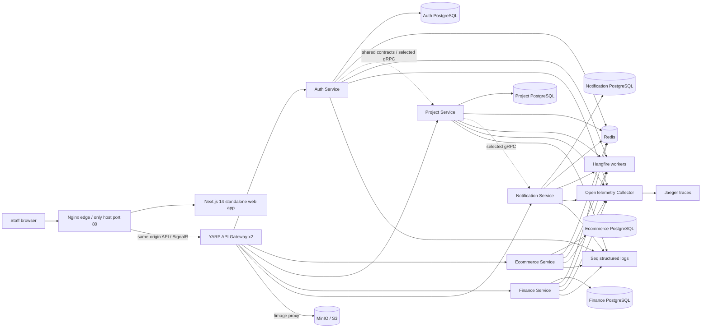
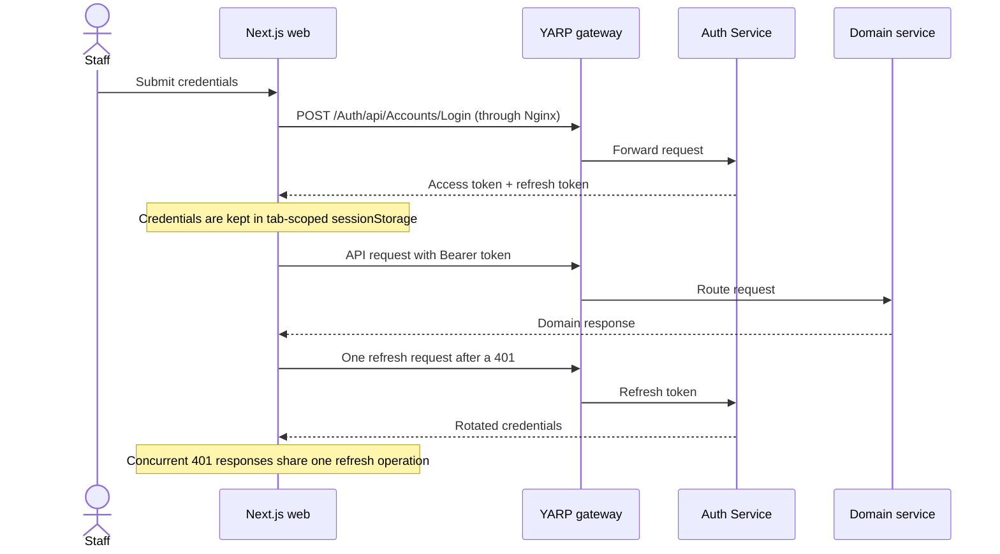

# System Architecture

This document is the maintained architecture source for VietWash. It describes the current repository and Docker Compose topology; Kubernetes is not part of the checked-in deployment model.

## Runtime topology

PostgreSQL is represented per service to show data ownership. Compose hosts those logical databases in one PostGIS container. Staging publishes only Nginx; frontend, gateways, services, PostgreSQL and Redis share a project-scoped Docker network without host ports. MinIO, Seq, Jaeger and OTEL shown here are optional supporting integrations, not part of the standard staging command. The frontend's relative API and media URLs return to the same Nginx origin.

## Service boundaries

| Component                 | Responsibility                                                                                                  |
| ------------------------- | --------------------------------------------------------------------------------------------------------------- |
| Next.js web               | Role-aware staff UI, localization, client-side query/cache state, and generated API integration                 |
| API Gateway               | YARP routing, CORS, rate limiting, device/client metadata, and optional route-level client identification       |
| Auth Service              | Accounts, profiles, roles, authentication, refresh tokens, OTP, and account jobs                                |
| Ecommerce Service         | Orders, customers, products, services, pricing, suppliers, materials, and payments                              |
| Project Service           | Branches, warehouses, organization structure, and branch-scoped configuration                                   |
| Finance Service           | Funds, fund behavior, and financial transactions                                                                |
| Notification Service      | Notification persistence, unread state, server pushes, and the SignalR hub                                      |
| Contracts / Shared Kernel | Cross-service DTOs, integration contracts, common persistence helpers, telemetry, and infrastructure primitives |

## Request and authentication flow

The current JSON token contract prevents a frontend-only `HttpOnly` refresh-token implementation. A future migration should set and rotate the refresh token in an `HttpOnly`, `Secure`, `SameSite` cookie at Auth Service, add CSRF protections where needed, and return only short-lived access-token material to JavaScript.

## API gateway client identification

The gateway can validate `X-Api-Key` and `Platform` only for routes whose YARP metadata contains `ApiKeyRequired=true`. Development routes do not enable that metadata. The browser variable is consequently named `NEXT_PUBLIC_CLIENT_ID`: it documents that the value is public identification, not a secret and not authorization. JWT validation and domain permissions remain the security boundary.

## Configuration and operations

- Development uses explicit local placeholders in tracked settings. Real secrets belong in environment variables, .NET user secrets, or deployment secret stores.
- Domain-service health checks remain internal. Nginx proxies `/health` to Gateway liveness; this does not certify dependency readiness.
- Hangfire workers and dashboards are configured in the domain services.
- Optional OpenTelemetry/Seq support stacks use localhost/private administration. Standard staging uses console logs and does not expose their receivers/UIs.
- Docker Compose is the repository's declared local/staging orchestration. Infrastructure images use explicit stable tags to avoid silent major upgrades.

## Deliberate constraints

- Service boundaries and the existing CQRS/Mediator organization remain unchanged in this cleanup.
- The legacy `src/EcommeceService` path is preserved for solution and deployment compatibility.
- Backend Dockerfiles retain their existing runtime users because mounted log-directory ownership varies by deployment host. The new standalone frontend image runs as non-root.
- Integration tests depend on PostgreSQL and are kept separate from the fast pull-request unit-test gate.
